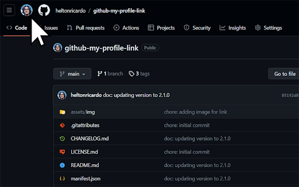

<h1 align="center">GitHub: My Profile Link 🔗</h1>

  
  
  

  

  <b>Adds a convenient link to your GitHub profile in the existing navigation bar:</b>

  

 

##### 👉🏻 [Link to Chrome Web Store](https://chrome.google.com/webstore/detail/github-my-profile-link/pgmjhnjdlhfmgkckbhkemdhipjkdedop)

##### 👉🏻 [Firefox Add-ons](https://addons.mozilla.org/firefox/addon/github-my-profile-link/)
